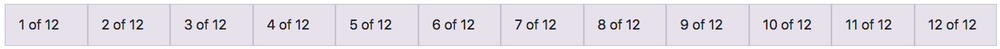
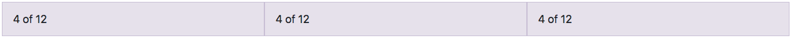
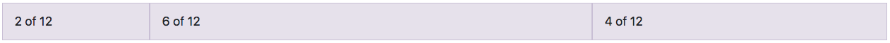

# CSS Frameworks

<iframe width="725" height="408" src="https://www.youtube.com/embed/dR0SRD4t2bo" frameborder="0" allow="accelerometer; autoplay; encrypted-media; gyroscope; picture-in-picture" allowfullscreen></iframe>

In the [Adding Some Style](adding-css.html) and [Responding to the Device](responsive.html) tutorials, you learned how to write style rules that change the appearance of your web pages. Although you could implement a entire site with only custom style rules, most professionals build upon a well-tested CSS framework instead. The framework normalizes browser default styling, applies consistent and attractive formatting to all HTML elements, and defines several style classes you can use for common UI components (badges, alerts, cards, responsive navigation bars, tabs, drop-down buttons, tool tips and popovers, sliders, switches, carousels, etc.). You can then add your own custom rules on top of the framework to tweak the default framework formatting.

A CSS framework is just a stylesheet with a bunch of rules that someone else wrote for you, and some accompanying JavaScript for the interactive features. There's nothing magic about it. You can look at the stylesheet and see all the rules that are defined in there, and it's all stuff you could have written yourself. But those rules have been crafted by professionals and tested on a wide array of browsers to ensure consistent results, so it's a good idea to build on top of them.

## Popular CSS Frameworks

There are several popular CSS frameworks to choose from. All of them provide beautiful formatting of HTML elements, pre-defined responsive multi-column layout grids that work on all browsers, and all the common UI elements you see on most web sites.

### Bootstrap

The most commonly-used CSS framework on the web is [Bootstrap](https://getbootstrap.com/). It was originally created at Twitter to enforce some consistency amongst their internal tools, but after they released it as an open-source project in 2011, it became very widely used. That wide use has benefits and drawbacks: it's very well tested, documented, and supported, but it's also so prevalent that it's default look has become cliché. Thankfully, it's rather easy to [customize Bootstrap](https://getbootstrap.com/docs/4.3/getting-started/theming/) with your own fonts, colors, sizing, etc. This is not something we will cover in this course but you should know it is possible.

### Foundation

Bootstrap's chief rival is [Foundation](https://foundation.zurb.com/). It has the reputation of being more ahead-of-the-curve than Bootstrap, introducing new features sooner. They were the first framework to use a responsive mobile-first design, and their new version 6 already offers a [flexbox-based responsive grid](https://foundation.zurb.com/sites/docs/flex-grid.html). Foundation has mostly the same UI elements as Bootstrap, but with a different default look at feel, which can also be [customized to match your own branding](https://foundation.zurb.com/sites/download.html/#customizeFoundation).

### Material Design Lite

Bootstrap and Foundation defined their own visual design language, but if you are a fan of [Google's Material Design](https://material.io/design/) instead, there are a few CSS frameworks based upon that. The official Google implementation is known as [Material Design Lite](https://getmdl.io/), or MDL for short. Material Design is very opinionated so MDL is difficult to customize beyond changing the primary and accent colors. Their style class names are also very verbose, as they follow the [Block, Element, Modifier (BEM)](https://en.bem.info/methodology/) naming method. But it's a well-implemented framework that has all the smarts and money of Google behind it.

### Materialize

The other popular Material Design implementation is [Materialize](https://materializecss.com/). This is an open-source project, so it's not supported by Google, [nor does Google feel that it's a "correct" implementation](https://getmdl.io/faq/#existing-implementations) of Material Design. Regardless, a lot of people use it, primarily because it's easy to learn if you are coming from Bootstrap.

## Adding a Framework to your Page

Each framework has a "getting started" page that describes your various options for adding the framework to your HTML page. Nearly all of them will let you link to their production files on a Content Delivery Network (CDN), download them as a zip file, or add them to your project via a package manager like `npm`. Each method has its benefits and drawbacks.

### Linking to a CDN

Linking to a CDN is a very easy option that has several benefits. The first is simplicity. For example, linking to Bootstrap's version 4.1.0 files on a CDN is as simple as adding these elements to the `<head>` section of your web page:

```html
<!-- Bootstrap v4.3.1 CSS stylesheet -->
<link rel="stylesheet" href="https://stackpath.bootstrapcdn.com/bootstrap/4.3.1/css/bootstrap.min.css" integrity="sha384-ggOyR0iXCbMQv3Xipma34MD+dH/1fQ784/j6cY/iJTQUOhcWr7x9JvoRxT2MZw1T" crossorigin="anonymous">

```

Add these elements right before the `</body>` tag on your web page:

```html
<!-- jQuery library (required by Bootstrap's JavaScript library) -->
<script src="https://code.jquery.com/jquery-3.3.1.slim.min.js" integrity="sha384-q8i/X+965DzO0rT7abK41JStQIAqVgRVzpbzo5smXKp4YfRvH+8abtTE1Pi6jizo" crossorigin="anonymous"></script>

<!-- PopperJS library (required by Bootstrap's JavaScript library) -->
<script src="https://cdnjs.cloudflare.com/ajax/libs/popper.js/1.14.7/umd/popper.min.js" integrity="sha384-UO2eT0CpHqdSJQ6hJty5KVphtPhzWj9WO1clHTMGa3JDZwrnQq4sF86dIHNDz0W1" crossorigin="anonymous"></script>

<!-- Bootstrap v4.3.1 JavaScript library -->
<script src="https://stackpath.bootstrapcdn.com/bootstrap/4.3.1/js/bootstrap.min.js" integrity="sha384-JjSmVgyd0p3pXB1rRibZUAYoIIy6OrQ6VrjIEaFf/nJGzIxFDsf4x0xIM+B07jRM" crossorigin="anonymous"></script>
```

Note that this loads version 4.3.1 specifically. Always check the [Bootstrap Getting Started page](https://getbootstrap.com/docs/4.1/getting-started/introduction/) to get the elements for their most current version.

Simplicity is one benefit, but **download speed** is another. Content Delivery Networks are a set of web servers that can deliver commonly-requested content very quickly all over the world. CDNs replicate their content to machines in several regions of the world, and use dynamic Domain Name Service (DNS) resolution to steer users to the machine nearest them. So a user in Australia might download the Bootstrap CSS from a server located in Singapore, while a user in France might get the same CSS file from a server located in Ireland. Although it may seem like the Internet is instantaneous, dragging files halfway around the world is still relatively slow. If the files are large, it can create a noticeable delay.

Another reason that CDNs increase download performance is **browser caching**. If multiple sites all use the CDN version of Bootstrap, then the browser only has to download that file the first time you visit one of those sites. The browser can then reuse the previously downloaded file for all other sites that link to the same URL. With popular frameworks like Bootstrap, it's highly likely that your user has already visited a site that links to Bootstrap's CDN version, and thus the Bootstrap CSS and JavaScript are already in the user's browser cache.

Another benefit is **dynamic patching**. If the developers of your framework discover a bug that can be patched without breaking existing code, they can re-release the patched file to the CDN, and your users' will automatically pick it up the next time they visit your site.

The only drawback of linking to a CDN is that it won't work when you are offline. If you commonly do your development offline, or if you are building a web application that is meant to run offline, you must download the CSS framework files into your project directory using one of the other two methods.

### Downloading a Zip

The second method for adding a CSS framework is downloading the files as a zip and unpacking them into your project directory. As noted above, one primary benefit of this approach is that the framework files will be **available even when you are offline**.

A second potential benefit is that framework sites often let you [customize the contents of the zip](https://foundation.zurb.com/sites/download.html/#customizeFoundation), adjusting fonts, colors, etc. For example, Foundation's customize page allows you to select only the components you need, and adjust base styling properties before downloading your customized zip file.

A third benefit is realized if you use the [Sass CSS pre-compiler](https://sass-lang.com/). These tools extend the CSS syntax to include features found in most other programming languages: variables, functions, inheritance, includes, mix-ins, etc. Most CSS frameworks are built using one of these two pre-compilers, and their **source files are commonly included in the downloaded zip**. You can then refer to these source files directly in your own Sass code, including only the parts of the framework you actually plan on using. You can also override their standard fonts, colors, sizes, etc., simply by resetting their variables.

A fourth benefit is realized if you use a build system like [gulp](https://gulpjs.com/) or [webpack](https://webpack.js.org/). It's common to link your HTML page to both your CSS framework's stylesheet and a few of your own, but this will result in one network round-trip per CSS file. If you download the framework's stylesheet, you can concatenate it with your own stylesheets, creating only one CSS file to download. This can enhance the page load experience, especially on slower mobile networks.

There are two main drawbacks to this method. First, it **adds large framework files to your code repository** that could easily be downloaded from the web as needed. Second, these **zips typically don't include other libraries that the framework depends upon**. For example, Bootstrap's JavaScript library requires the jQuery library, but that's not included in their distribution zip file, as the jQuery library is maintained by a different set of people. To eliminate both of these drawbacks, use a package manager.

### Using a Package Manager

Package managers are command-line programs that consult online directories of available packages, find all other packages a given package depends upon, and download all of them to a subdirectory within your project directory. They also commonly record the set of packages your program is using in a special file that you can add to your project's code repository. This takes the guess-work out of determining the set of packages you need for a given framework, and makes it really simple for a new developer joining your project to get all the packages your project needs in order to run.

In the web development space, the most commonly-used package managers are [npm](https://www.npmjs.com/) and [bower](https://bower.io/). The former was originally created for the server-side Node.js environment, while the latter was a fork of the former, adjusted for the special needs of client-side web development projects. Since then, `npm` has expanded to include both server and client-side packages, so these days you can use either in most circumstances.

Let's see how we can use `npm` to install the Bootstrap CSS framework. You first need to [install Node.js](https://nodejs.org/en/), which installs `npm`.

NPM uses the [`git` command line tools](https://git-scm.com/downloads) to clone packages from their source repositories, so if you don't already have the `git` command line tools installed, you need to install them as well. You can verify if you have the `git` command line tools installed by running this command:

```bash
git --version
```

If you get a command not found error, you need to install the tools.

To use `npm` in a project, you first run this command **within your project directory** to create the file it uses to track meta-data about your project, including the packages your project depends on:

```bash
npm init
```

You can accept all the default values by hitting `Enter` after each prompt. After all the prompts are answered, it creates a file named `package.json` to capture all the meta-data about your project. You should add, commit, and push this file to your code repository.

You can then install Bootstrap's files and record your dependency upon it using this command:

```bash
npm install bootstrap --save-dev
npm install jquery --save-dev
npm install popper.js --save-dev
```

This will download both the Bootstrap and jQuery packages (because Bootstrap depends on jQuery) to a new directory named node_modules. You can then include them in your page by adding these elements to your `<head>` section:

```html
<!-- Bootstrap CSS stylesheet -->
<link rel="stylesheet" href="node_modules/bootstrap/dist/css/bootstrap.min.css">
```

Add these elements right before the `</body>` tag on your web page:

```html
<!-- jQuery library (required by Bootstrap's JavaScript library) -->
<script src="node_modules/jquery/dist/jquery.slim.min.js"></script>

<!-- PopperJS library (required by Bootstrap's JavaScript library) -->
<script src="node_modules/popper.js/dist/umd/popper.min.js" ></script>

<!-- Bootstrap JavaScript library -->
<script src="node_modules/boostrap/dist/js/bootstrap.min.js" ></script>
```

Note that the URLs in the `href` attributes are no longer absolute URLs pointing to a CDN. Instead they are relative URLs pointing to a sub-directory named `node_modules`. This directly will need to be on your web server so that the server can send these files to the user's browser.

When new developers join your project, they can quickly install all the packages listed in the package.json file, as well as all of their dependencies, using this one command:

```bash
npm install
```

Because this simple command will install the packages on-demand, it's customary to add the `node_modules` directory to your `.gitignore` file. That way the files in that directory won't be added to your repository. The only exception to this rule is if you are using GitHub pages to host your site. If so, the `node_modules` directory must be added to your repo so that GitHub pages can serve the files to the browser.

You can also use `npm` to upgrade packages, or remove them from your project. See the [npm documentation](https://docs.npmjs.com/) for more details.

### Which is Best? CDN or Download?

If you ask a group of developers which is the better approach—linking to a CDN or downloading via a package manager—you'll probably start a very heated debate. It's kind of like the [spaces v. tabs debate](https://www.youtube.com/watch?v=SsoOG6ZeyUI). Each method has its benefits and drawbacks, and neither option is clearly superior to the other. But choose you must, and your choice should be something you stick with. The one thing you don't want to do is mix the two approaches in one project.

If you are new to web development and can't decide which approach to use, link to the CDN version. It's simple and the lack of offline support probably won't affect you much.


::: tip For this class, we will using the CDN version of Bootstrap
This will allow us to learn the concepts without all the setup.
:::

## Responsive Layout Grids

At the core of all of these popular CSS Frameworks is a responsive grid layout system. These grids allow you to build multi-column layouts on all browsers, even those that don't support the new flexbox standard. These grids use very complicated CSS syntax to achieve this effect, and can still end-up with rendering problems, but they are your only option if you need to provide multi-column layout to IE users.

These grid systems divide the horizontal line into 12 equal units. A given element can span as many of these grid units as you want, but after 12 units, the next element will wrap to the next line. Since 12 can be divided evenly by 6, 4, or 3, you can easily create layouts with 2, 3, or 4 equally-sized columns that sit next to each other on the same line. Or you can create one column that spans 4 units and another that spans 8 units. Any combination that adds up to 12 is fine.

### 12 column grid example



The number of grid units any given element consumes is specified using specially-named CSS style classes. For example, this markup uses Bootstrap to create three equally-sized columns on all screens:

```html
<div class="container">
  <div class="row">
    <div class="col-4">
      One of three columns
    </div>
    <div class="col-4">
      One of three columns
    </div>
    <div class="col-4">
      One of three columns
    </div>
  </div>
</div>
```

### 3 column grid, each column taking up 4 slots



### The columns are not required to be equal size

The total 'col' values can only add up to 12.



If the columns add up to more than 12, the additional items will be placed on the next row.

## Containers

In Bootstrap, grids should always be put inside an element with `class="container"` or `class="container-fluid"`. Both of these style classes add a little padding to the left and right, and the container class sets the width property so that it doesn't grow ridiculously wide on large desktop monitors.

The `<div class="row">` element starts a new row, and each direct child `<div>` within that row element defines a new column. The style class col-4 tells Bootstrap that the element be a column on "extra small" screens and larger, so all three of those `<div>` elements will appear side-by-side on all screen sizes. 

Here's what it looks like in the browser:

<iframe height="265" style="width: 100%;" scrolling="no" title="IMT 549 - Bootstrap columns (all viewports)" src="//codepen.io/nickdenardis/embed/RyWaqY/?height=265&theme-id=0&default-tab=result" frameborder="no" allowtransparency="true" allowfullscreen="true">
  See the Pen <a href='https://codepen.io/nickdenardis/pen/RyWaqY/'>IMT 549 - Bootstrap columns (all viewports)</a> by Nick DeNardis
  (<a href='https://codepen.io/nickdenardis'>@nickdenardis</a>) on <a href='https://codepen.io'>CodePen</a>.
</iframe>

That's handy, but the real power comes when you want that layout to respond to the screen size, reverting to a single stacked set of elements on extra small phone screens. To do that, we just adjust the style classes:

```html
<div class="container">
    <div class="row">
        <div class="col-sm-4">
            <h2>Column 1</h2>
            <p>Lorem ipsum dolor sit amet, consectetur adipisicing elit.</p>
        </div>
        <div class="col-sm-4">
            <h2>Column 2</h2>
            <p>Lorem ipsum dolor sit amet, consectetur adipisicing elit.</p>
        </div>
        <div class="col-sm-4">
            <h2>Column 3</h2>
            <p>Lorem ipsum dolor sit amet, consectetur adipisicing elit.</p>
        </div>
    </div>
</div>
```

Note that the `col` classes became `col-sm`. By default, the `<div>` elements will stretch to fill the entire row and thus stack on top of each other, but the `col-sm` will create a multi-column layout on small screens and larger (`>=576px`). If you look in the [Bootstrap stylesheet](https://github.com/twbs/bootstrap/blob/v4-dev/dist/css/bootstrap.css#L826), you'll see that those `col-sm` style classes are defined within a media rule block that has the condition `min-width(576px)`, so they are applied only when the screen size is at least `576px` wide. Here's what it looks like in the browser:

<iframe height="265" style="width: 100%;" scrolling="no" title="IMT549 - Bootstrap columns (small and up)" src="//codepen.io/nickdenardis/embed/WJQwBN/?height=265&theme-id=0&default-tab=result" frameborder="no" allowtransparency="true" allowfullscreen="true">
  See the Pen <a href='https://codepen.io/nickdenardis/pen/WJQwBN/'>IMT549 - Bootstrap columns (small and up)</a> by Nick DeNardis
  (<a href='https://codepen.io/nickdenardis'>@nickdenardis</a>) on <a href='https://codepen.io'>CodePen</a>.
</iframe>

Bootstrap also defines classes for `col-md-*`, which are in media rule blocks with the condition `min-width(768px)`, and `col-lg-*` classes, which are in media rule blocks with the condition `min-width(992px)`, and `col-xl-*` classes, which are in media rule blocks with the condition `min-width(1200px)`.

You can also combine these classes to create different layouts on different sizes of screens:

```html
<div class="container">
    <div class="row">
        <div class="col-sm-4 col-md-4">
            <h2>Column 1</h2>
            <p>Lorem ipsum dolor sit amet, consectetur adipisicing elit.</p>
        </div>
        <div class="col-sm-8 col-md-4">
            <h2>Column 2</h2>
            <p>Lorem ipsum dolor sit amet, consectetur adipisicing elit.</p>
        </div>
        <div class="col-sm-12 col-md-4">
            <h2>Column 3</h2>
            <p>Lorem ipsum dolor sit amet, consectetur adipisicing elit.</p>
        </div>
    </div>
</div>
```

With this markup, the first column consumes 4 grid units on small and medium screens, the second column consumes 8 grid units on small screens but only 4 on medium screens, and the third consumes 12 units on small screens but only 4 on medium screens. On a small screens, the first two columns sit side-by-side, but the third wraps to the next line and stretches across the entire row.

<iframe height="265" style="width: 100%;" scrolling="no" title="IMT 549 - Bootstrap columns (small and medium)" src="//codepen.io/nickdenardis/embed/JvYXgM/?height=265&theme-id=0&default-tab=result" frameborder="no" allowtransparency="true" allowfullscreen="true">
  See the Pen <a href='https://codepen.io/nickdenardis/pen/JvYXgM/'>IMT 549 - Bootstrap columns (small and medium)</a> by Nick DeNardis
  (<a href='https://codepen.io/nickdenardis'>@nickdenardis</a>) on <a href='https://codepen.io'>CodePen</a>.
</iframe>

See the [Bootstrap grid system documentation](https://getbootstrap.com/docs/4.3/layout/grid/) for more details.

## UI Components

Besides a responsive grid system, CSS Frameworks like Bootstrap also offer a host of useful UI components. For example, adding a Bootstrap alert to your page requires this simple markup:

```html
<div class="alert alert-danger" role="alert">Danger Will Robinson, Danger!</div>
```

<iframe height="265" style="width: 100%;" scrolling="no" title="IMT 549 - Bootstrap alert" src="//codepen.io/nickdenardis/embed/erpzNW/?height=265&theme-id=0&default-tab=result" frameborder="no" allowtransparency="true" allowfullscreen="true">
  See the Pen <a href='https://codepen.io/nickdenardis/pen/erpzNW/'>IMT 549 - Bootstrap alert</a> by Nick DeNardis
  (<a href='https://codepen.io/nickdenardis'>@nickdenardis</a>) on <a href='https://codepen.io'>CodePen</a>.
</iframe>

The `role="alert"` attribute is included to help screen readers know that this element is something more than a generic `<div>` element. The role attribute is defined in the [ARIA accessibility standard](https://a11yproject.com/posts/getting-started-aria/), and it's good practice to add this attribute to elements that play a role that is different from what the element name normally suggests.

To allow users to dismiss an alert, just extend your markup like this:

```html
<div class="alert alert-warning alert-dismissible fade show" role="alert">
  <strong>Holy guacamole!</strong> You should check in on some of those fields below.
  <button type="button" class="close" data-dismiss="alert" aria-label="Close">
    <span aria-hidden="true">&times;</span>
  </button>
</div>
```

<iframe height="265" style="width: 100%;" scrolling="no" title="IMT 549 - Bootstrap alert dismissible" src="//codepen.io/nickdenardis/embed/MRXjEe/?height=265&theme-id=0&default-tab=result" frameborder="no" allowtransparency="true" allowfullscreen="true">
  See the Pen <a href='https://codepen.io/nickdenardis/pen/MRXjEe/'>IMT 549 - Bootstrap alert dismissible</a> by Nick DeNardis
  (<a href='https://codepen.io/nickdenardis'>@nickdenardis</a>) on <a href='https://codepen.io'>CodePen</a>.
</iframe>

Just like the `role` attribute, the `aria-label` and `aria-hidden` attributes are defined in the ARIA accessibility standard. The former provides a pronounceable `label` for the close button, and the latter tells the screen reader to ignore the `&times;` HTML entity, as it won't be able to describe it in any sensible way.

Try experimenting with other [Bootstrap UI Components](https://getbootstrap.com/docs/4.3/components/alerts/) using my [Bootstrap Playground CodePen](https://codepen.io/nickdenardis/pen/WJQxwQ). Copy/paste the markup from Bootstrap's documentation to see what it creates.

## Larger Application Components

Bootstrap offers all kinds of simple UI components like these, but it also has some more complex ones that are useful in web applications. For example, you can add a modal dialog to your page and open it from a button:

```html
<!-- Button trigger modal -->
<button type="button" class="btn btn-primary" data-toggle="modal" data-target="#exampleModalLong">
  Launch demo modal
</button>

<!-- Modal -->
<div class="modal fade" id="exampleModalLong" tabindex="-1" role="dialog" aria-labelledby="exampleModalLongTitle" aria-hidden="true">
  <div class="modal-dialog" role="document">
    <div class="modal-content">
      <div class="modal-header">
        <h5 class="modal-title" id="exampleModalLongTitle">Modal title</h5>
        <button type="button" class="close" data-dismiss="modal" aria-label="Close">
          <span aria-hidden="true">&times;</span>
        </button>
      </div>
      <div class="modal-body">
        ...
      </div>
      <div class="modal-footer">
        <button type="button" class="btn btn-secondary" data-dismiss="modal">Close</button>
        <button type="button" class="btn btn-primary">Save changes</button>
      </div>
    </div>
  </div>
</div>
```

<iframe height="265" style="width: 100%;" scrolling="no" title="IMT 549 - Bootstrap 4 modal" src="//codepen.io/nickdenardis/embed/PePOOo/?height=265&theme-id=0&default-tab=result" frameborder="no" allowtransparency="true" allowfullscreen="true">
  See the Pen <a href='https://codepen.io/nickdenardis/pen/PePOOo/'>IMT 549 - Bootstrap 4 modal</a> by Nick DeNardis
  (<a href='https://codepen.io/nickdenardis'>@nickdenardis</a>) on <a href='https://codepen.io'>CodePen</a>.
</iframe>

These application components are more useful when you add your own JavaScript, which you will learn how to do in later tutorials.

### Keep Learning

This has only scratched the surface of what you can do with a CSS framework like [Bootstrap](https://getbootstrap.com/), [Foundation](https://foundation.zurb.com/), [Materialize](https://materializecss.com/), or [Material Design Lite](https://getmdl.io/). To learn more, see their respective documentation.